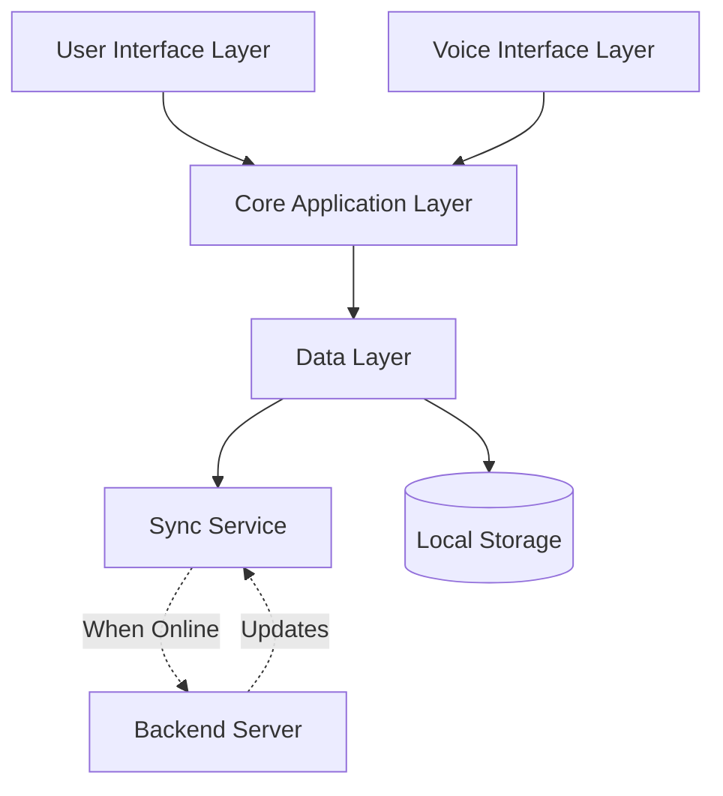

# Design Document: JeevanMap AI Healthcare Assistant

## Overview

JeevanMap AI is an offline-first, voice-enabled mobile healthcare assistant designed for rural populations in India. The system architecture prioritizes simplicity, offline functionality, and accessibility for low-literacy users. The application will be built as a native Android application with a local-first data architecture, embedded speech recognition, and a minimal UI optimized for basic smartphones.

The core design philosophy is "offline by default" - all features must work without internet connectivity, with synchronization happening opportunistically when connectivity is available.

## Architecture

### High-Level Architecture



### Architectural Principles

1. **Offline-First**: All data required for core functionality is stored locally
2. **Event-Driven**: User actions trigger events that update local state
3. **Eventual Consistency**: Server synchronization happens asynchronously when connectivity is available
4. **Layered Architecture**: Clear separation between UI, business logic, and data layers
5. **Resource-Conscious**: Optimized for devices with 1GB RAM and limited storage

### Technology Stack

- **Platform**: Android (API Level 21+, Android 5.0+)
- **Language**: Kotlin for application code
- **Database**: SQLite with Room persistence library for local storage
- **Voice Recognition**: Google Speech Recognition API with offline language packs
- **Text-to-Speech**: Android TTS engine with offline voices
- **Location**: Android Location Services (GPS + Network)
- **Sync**: WorkManager for background synchronization
- **UI Framework**: Jetpack Compose with Material Design 3

## Components and Interfaces

### 1. User Interface Layer

**Responsibility**: Provide simple, icon-based navigation and display information clearly

**Components**:
- `MainActivity`: Entry point with bottom navigation for core features
- `HomeScreen`: Dashboard with large icons for primary actions
- `HealthcareCenterScreen`: List and map view of nearby facilities
- `EmergencyScreen`: One-tap emergency contacts
- `SchemeCheckerScreen`: Eligibility questionnaire and results
- `ReminderScreen`: List of upcoming health reminders
- `SettingsScreen`: Language selection and data management

**Interface Design Principles**:
- Maximum 6 primary actions on home screen
- Icon size minimum 64dp with text labels
- High contrast colors (WCAG AA compliant)
- Single-level navigation (no nested menus)
- Visual feedback within 500ms for all interactions

### 2. Voice Interface Layer

**Responsibility**: Handle speech input and provide audio responses

**Components**:
- `VoiceCommandProcessor`: Processes recognized speech and maps to actions
- `SpeechRecognizer`: Wrapper around Android Speech Recognition API
- `TextToSpeechEngine`: Wrapper around Android TTS engine
- `LanguageModelManager`: Manages offline language packs

**Voice Commands Supported**:
- "Find hospital" / "नज़दीकी अस्पताल" → Navigate to healthcare center search
- "Emergency" / "आपातकाल" → Navigate to emergency contacts
- "Check scheme" / "योजना जांचें" → Navigate to eligibility checker
- "My reminders" / "मेरे रिमाइंडर" → Navigate to reminders

**Interface**:
```kotlin
interface VoiceCommandProcessor {
    fun processCommand(recognizedText: String, language: String): VoiceCommand
    fun executeCommand(command: VoiceCommand)
}

sealed class VoiceCommand {
    object FindHealthcare : VoiceCommand()
    object ShowEmergency : VoiceCommand()
    object CheckScheme : VoiceCommand()
    object ShowReminders : VoiceCommand()
    data class Unknown(val text: String) : VoiceCommand()
}
```

### 3. Core Application Layer

**Responsibility**: Business logic and orchestration between components

**Components**:

**HealthcareCenterService**:
- Calculates distances from user location to healthcare centers
- Filters and sorts facilities by distance
- Provides directions and contact information

```kotlin
interface HealthcareCenterService {
    suspend fun findNearby(location: Location, radiusKm: Double): List<HealthcareCenter>
    suspend fun getDetails(centerId: String): HealthcareCenterDetails
    fun calculateDistance(from: Location, to: Location): Double
}
```

**EmergencyContactService**:
- Retrieves emergency contacts for user's district
- Initiates phone calls

```kotlin
interface EmergencyContactService {
    suspend fun getEmergencyContacts(district: String): List<EmergencyContact>
    fun initiateCall(phoneNumber: String)
}
```

**EligibilityCheckerService**:
- Evaluates user demographics against scheme criteria
- Returns matching schemes with details

```kotlin
interface EligibilityCheckerService {
    suspend fun checkEligibility(userProfile: UserProfile): List<HealthScheme>
    suspend fun getSchemeDetails(schemeId: String): SchemeDetails
}

data class UserProfile(
    val age: Int,
    val gender: Gender,
    val income: IncomeCategory,
    val hasRationCard: Boolean,
    val cardType: RationCardType?,
    val isPregnant: Boolean,
    val hasChildren: Boolean,
    val district: String
)
```

**ReminderService**:
- Manages maternal and child health reminder schedules
- Triggers notifications at appropriate times

```kotlin
interface ReminderService {
    suspend fun createPregnancySchedule(expectedDeliveryDate: LocalDate): List<Reminder>
    suspend fun createChildSchedule(birthDate: LocalDate): List<Reminder>
    suspend fun getUpcomingReminders(userId: String): List<Reminder>
    suspend fun markReminderComplete(reminderId: String)
    suspend fun rescheduleReminder(reminderId: String, newDate: LocalDate)
}
```

**LocationService**:
- Determines user location via GPS or manual input
- Validates location names

```kotlin
interface LocationService {
    suspend fun getCurrentLocation(): Location?
    suspend fun searchLocation(query: String): List<LocationResult>
    suspend fun validateLocation(locationName: String): Boolean
}
```

### 4. Data Layer

**Responsibility**: Manage local data storage and synchronization

**Database Schema**:

```sql
-- Healthcare Centers
CREATE TABLE healthcare_centers (
    id TEXT PRIMARY KEY,
    name TEXT NOT NULL,
    type TEXT NOT NULL, -- PHC, CHC, District Hospital, etc.
    latitude REAL NOT NULL,
    longitude REAL NOT NULL,
    address TEXT,
    phone TEXT,
    services TEXT, -- JSON array of available services
    district TEXT NOT NULL,
    last_updated INTEGER NOT NULL
);

-- Emergency Contacts
CREATE TABLE emergency_contacts (
    id TEXT PRIMARY KEY,
    service_name TEXT NOT NULL,
    phone_number TEXT NOT NULL,
    service_type TEXT NOT NULL, -- Ambulance, Hospital, Health Officer
    district TEXT NOT NULL,
    service_area TEXT,
    last_updated INTEGER NOT NULL
);

-- Health Schemes
CREATE TABLE health_schemes (
    id TEXT PRIMARY KEY,
    name TEXT NOT NULL,
    name_local TEXT NOT NULL, -- Localized name
    description TEXT NOT NULL,
    benefits TEXT NOT NULL, -- JSON array
    eligibility_criteria TEXT NOT NULL, -- JSON object
    required_documents TEXT NOT NULL, -- JSON array
    application_process TEXT,
    contact_info TEXT,
    last_updated INTEGER NOT NULL
);

-- User Profiles
CREATE TABLE user_profiles (
    id TEXT PRIMARY KEY,
    age INTEGER,
    gender TEXT,
    income_category TEXT,
    has_ration_card INTEGER,
    ration_card_type TEXT,
    district TEXT,
    village TEXT,
    preferred_language TEXT NOT NULL,
    created_at INTEGER NOT NULL,
    updated_at INTEGER NOT NULL
);

-- Pregnancy Cases (for ASHA workers and pregnant women)
CREATE TABLE pregnancy_cases (
    id TEXT PRIMARY KEY,
    user_id TEXT,
    woman_name TEXT NOT NULL,
    expected_delivery_date INTEGER NOT NULL,
    registered_by TEXT, -- ASHA worker ID if applicable
    created_at INTEGER NOT NULL,
    updated_at INTEGER NOT NULL,
    FOREIGN KEY (user_id) REFERENCES user_profiles(id)
);

-- Child Records
CREATE TABLE child_records (
    id TEXT PRIMARY KEY,
    user_id TEXT,
    child_name TEXT NOT NULL,
    birth_date INTEGER NOT NULL,
    registered_by TEXT, -- ASHA worker ID if applicable
    created_at INTEGER NOT NULL,
    updated_at INTEGER NOT NULL,
    FOREIGN KEY (user_id) REFERENCES user_profiles(id)
);

-- Reminders
CREATE TABLE reminders (
    id TEXT PRIMARY KEY,
    type TEXT NOT NULL, -- MATERNAL, CHILD
    related_id TEXT NOT NULL, -- pregnancy_case_id or child_record_id
    title TEXT NOT NULL,
    description TEXT NOT NULL,
    due_date INTEGER NOT NULL,
    completed INTEGER DEFAULT 0,
    completed_at INTEGER,
    created_at INTEGER NOT NULL
);

-- Vaccination Records
CREATE TABLE vaccination_records (
    id TEXT PRIMARY KEY,
    child_id TEXT NOT NULL,
    vaccine_name TEXT NOT NULL,
    scheduled_date INTEGER NOT NULL,
    administered_date INTEGER,
    administered INTEGER DEFAULT 0,
    FOREIGN KEY (child_id) REFERENCES child_records(id)
);

-- Sync Queue (tracks pending updates to send to server)
CREATE TABLE sync_queue (
    id TEXT PRIMARY KEY,
    entity_type TEXT NOT NULL,
    entity_id TEXT NOT NULL,
    operation TEXT NOT NULL, -- INSERT, UPDATE, DELETE
    payload TEXT NOT NULL, -- JSON
    created_at INTEGER NOT NULL,
    retry_count INTEGER DEFAULT 0
);
```

**Data Access Objects (DAOs)**:

```kotlin
interface HealthcareCenterDao {
    suspend fun findNearby(latitude: Double, longitude: Double, limit: Int): List<HealthcareCenter>
    suspend fun findByDistrict(district: String): List<HealthcareCenter>
    suspend fun getById(id: String): HealthcareCenter?
    suspend fun insertAll(centers: List<HealthcareCenter>)
    suspend fun updateLastSynced(timestamp: Long)
}

interface ReminderDao {
    suspend fun getUpcoming(userId: String, fromDate: Long): List<Reminder>
    suspend fun insert(reminder: Reminder)
    suspend fun markComplete(reminderId: String, completedAt: Long)
    suspend fun reschedule(reminderId: String, newDueDate: Long)
}
```

### 5. Synchronization Service

**Responsibility**: Sync local data with backend server when connectivity is available

**Components**:
- `SyncWorker`: Background worker that runs periodically
- `SyncManager`: Orchestrates sync operations
- `ConflictResolver`: Handles data conflicts (server vs local)

**Sync Strategy**:
1. **Download Priority**: Healthcare centers, emergency contacts, scheme data (reference data)
2. **Upload Priority**: User profiles, pregnancy cases, child records, vaccination records
3. **Conflict Resolution**: Last-write-wins for user data, server-wins for reference data
4. **Sync Frequency**: Every 24 hours when on WiFi, weekly on mobile data

```kotlin
interface SyncManager {
    suspend fun syncAll(): SyncResult
    suspend fun syncReferenceData(): SyncResult
    suspend fun syncUserData(): SyncResult
    fun getLastSyncTime(): Long?
}

data class SyncResult(
    val success: Boolean,
    val itemsSynced: Int,
    val errors: List<SyncError>
)
```

## Data Models

### Core Domain Models

```kotlin
data class HealthcareCenter(
    val id: String,
    val name: String,
    val type: FacilityType,
    val location: Location,
    val address: String,
    val phone: String?,
    val services: List<String>,
    val district: String,
    val distanceKm: Double? = null // Calculated at runtime
)

enum class FacilityType {
    SUB_CENTER,
    PRIMARY_HEALTH_CENTER,
    COMMUNITY_HEALTH_CENTER,
    DISTRICT_HOSPITAL,
    MEDICAL_COLLEGE,
    PRIVATE_HOSPITAL
}

data class Location(
    val latitude: Double,
    val longitude: Double
)

data class EmergencyContact(
    val id: String,
    val serviceName: String,
    val phoneNumber: String,
    val serviceType: ServiceType,
    val district: String,
    val serviceArea: String?
)

enum class ServiceType {
    AMBULANCE_108,
    AMBULANCE_102,
    HOSPITAL_EMERGENCY,
    DISTRICT_HEALTH_OFFICER,
    BLOOD_BANK
}

data class HealthScheme(
    val id: String,
    val name: String,
    val nameLocal: String,
    val description: String,
    val benefits: List<String>,
    val eligibilityCriteria: EligibilityCriteria,
    val requiredDocuments: List<String>,
    val applicationProcess: String?,
    val contactInfo: String?
)

data class EligibilityCriteria(
    val minAge: Int?,
    val maxAge: Int?,
    val gender: Gender?,
    val maxIncome: Int?,
    val requiresRationCard: Boolean,
    val allowedCardTypes: List<RationCardType>?,
    val isForPregnantWomen: Boolean,
    val isForChildren: Boolean,
    val additionalConditions: Map<String, Any>
)

enum class Gender { MALE, FEMALE, OTHER }
enum class IncomeCategory { BPL, APL, ANTYODAYA }
enum class RationCardType { BPL, APL, ANTYODAYA, NONE }

data class Reminder(
    val id: String,
    val type: ReminderType,
    val relatedId: String,
    val title: String,
    val description: String,
    val dueDate: LocalDate,
    val completed: Boolean,
    val completedAt: LocalDate?
)

enum class ReminderType {
    MATERNAL_CHECKUP,
    MATERNAL_VACCINATION,
    MATERNAL_NUTRITION,
    CHILD_VACCINATION,
    CHILD_CHECKUP
}

data class PregnancyCase(
    val id: String,
    val userId: String?,
    val womanName: String,
    val expectedDeliveryDate: LocalDate,
    val registeredBy: String?,
    val reminders: List<Reminder>
)

data class ChildRecord(
    val id: String,
    val userId: String?,
    val childName: String,
    val birthDate: LocalDate,
    val registeredBy: String?,
    val vaccinations: List<VaccinationRecord>,
    val reminders: List<Reminder>
)

data class VaccinationRecord(
    val id: String,
    val childId: String,
    val vaccineName: String,
    val scheduledDate: LocalDate,
    val administeredDate: LocalDate?,
    val administered: Boolean
)
```

### Reminder Schedules

**Maternal Health Schedule** (based on expected delivery date):
- Week 12: First ANC checkup
- Week 16: Second ANC checkup, TT1 vaccination
- Week 20: Third ANC checkup
- Week 24: Fourth ANC checkup, TT2 vaccination
- Week 28: Fifth ANC checkup
- Week 32: Sixth ANC checkup
- Week 36: Seventh ANC checkup
- Week 38: Eighth ANC checkup
- Week 40: Expected delivery
- Week 42 (postpartum): Postnatal checkup
- Week 48 (postpartum): Final postnatal checkup

**Child Immunization Schedule** (based on birth date):
- Birth: BCG, OPV-0, Hepatitis B-1
- 6 weeks: DPT-1, OPV-1, Hepatitis B-2, Hib-1, Rotavirus-1, PCV-1
- 10 weeks: DPT-2, OPV-2, Hib-2, Rotavirus-2, PCV-2
- 14 weeks: DPT-3, OPV-3, Hepatitis B-3, Hib-3, Rotavirus-3, PCV-3
- 9 months: Measles-1, OPV-4
- 16-24 months: DPT Booster-1, OPV-5, Measles-2
- 5-6 years: DPT Booster-2

## Correctness Properties

*A property is a characteristic or behavior that should hold true across all valid executions of a system—essentially, a formal statement about what the system should do. Properties serve as the bridge between human-readable specifications and machine-verifiable correctness guarantees.*

Before defining the correctness properties, let me analyze the acceptance criteria for testability:

